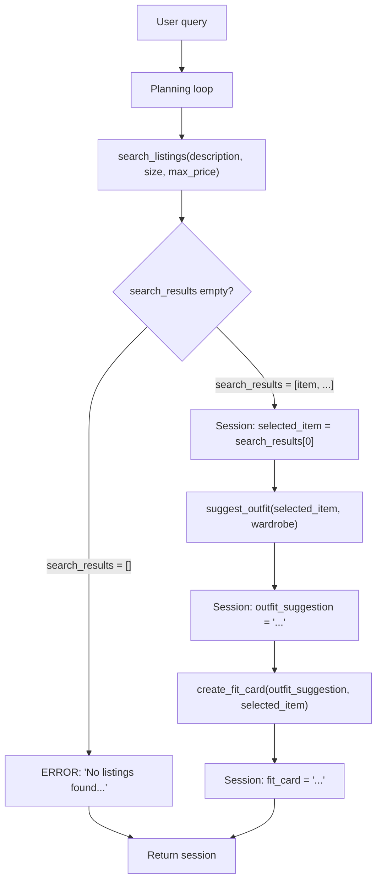

# FitFindr — planning.md

> Complete this document before writing any implementation code.
> Your spec and agent diagram are what you'll use to direct AI tools (Claude, Copilot, etc.) to generate your implementation — the more specific they are, the more useful the generated code will be.
> Your planning.md will be reviewed as part of your submission.
> Update it before starting any stretch features.

---

## Tools

List every tool your agent will use. For each tool, fill in all four fields.
You must have at least 3 tools. The three required tools are listed — add any additional tools below them.

### Tool 1: search_listings

**What it does:**
<!-- Describe what this tool does in 1–2 sentences -->

Searches the mock listings dataset and returns matching items. Must handle the case where no matches are found.

**Input parameters:**
<!-- List each parameter, its type, and what it represents -->

- `description` (str): Keywords describing what the user is looking for (e.g., "vintage graphic tee").
- `size` (str): Size string to filter by, or None to skip size filtering. Matching is case-insensitive (e.g., "M" matches "S/M").
- `max_price` (float): Maximum price (inclusive), or None to skip price filtering.

**What it returns:**
<!-- Describe the return value — what fields does a result contain? -->

Returns a list of matching listing dicts, sorted by relevance (best match first).

**What happens if it fails or returns nothing:**
<!-- What should the agent do if no listings match? -->

Returns an empty list if nothing matches — does NOT raise an exception.

---

### Tool 2: suggest_outfit

**What it does:**
<!-- Describe what this tool does in 1–2 sentences -->

Given a specific item and the user's current wardrobe, suggests one or more complete outfit combinations. Must handle an empty or minimal wardrobe.

**Input parameters:**
<!-- List each parameter, its type, and what it represents -->
- `new_item` (dict): A listing dict (the item the user is considering buying).
- `wardrobe` (dict): A wardrobe dict with an 'items' key containing a list of wardrobe item dicts. May be empty — handle this.

**What it returns:**
<!-- Describe the return value -->

A non-empty string with outfit suggestions.

**What happens if it fails or returns nothing:**
<!-- What should the agent do if the wardrobe is empty or no outfit can be suggested? -->

If the wardrobe is empty/minimal wardrobe that combinations are limited, offer general styling advice for the item rather than raising an exception or returning an empty string.

---

### Tool 3: create_fit_card

**What it does:**
<!-- Describe what this tool does in 1–2 sentences -->

Generates a short, shareable description of a complete outfit — the kind of thing someone would caption an Instagram post with. Must produce something different each time for different inputs.

**Input parameters:**
<!-- List each parameter, its type, and what it represents -->
- `outfit` (str): The outfit suggestion string from suggest_outfit().
- `new_item` (dict): The listing dict for the thrifted item.

**What it returns:**
<!-- Describe the return value -->

A 2–4 sentence string usable as an Instagram/TikTok caption.
The caption should:
- Feel casual and authentic (like a real OOTD post, not a product description)
- Mention the item name, price, and platform naturally (once each)
- Capture the outfit vibe in specific terms
- Sound different each time for different inputs (use higher LLM temperature)

**What happens if it fails or returns nothing:**
<!-- What should the agent do if the outfit data is incomplete? -->

If outfit is empty or missing, return a descriptive error message string — do NOT raise an exception.

---

### Additional Tools (if any)

<!-- Copy the block above for any tools beyond the required three -->

---

## Planning Loop

**How does your agent decide which tool to call next?**
<!-- Describe the logic your planning loop uses. What does it look at? What conditions change its behavior? How does it know when it's done? -->

The agent runs a fixed three-stage pipeline and only advances when the current stage produces usable output. At each step it inspects the session state and decides the next call:

1. **`search_listings`** runs first on the user's request. Check whether `search_results` is empty. If it is, store an error message in the session and return early — no further tool is called. Otherwise set `selected_item = search_results[0]` and proceed to `suggest_outfit`.

2. **`suggest_outfit`** runs on `selected_item` plus the user's wardrobe. If the wardrobe is empty, it still returns a usable string — general styling advice for the item on its own — rather than ending early. Either way the outfit suggestion is stored and the loop proceeds to `create_fit_card`.

3. **`create_fit_card`** runs on the outfit suggestion. If the outfit data is missing or incomplete, store an error message and return early. Otherwise store the caption — the result is now complete (listing + styling + caption) and the loop terminates.

---

## State Management

**How does information from one tool get passed to the next?**
<!-- Describe how your agent stores and accesses state within a session. What data is tracked? How is it passed between tool calls? -->

All state lives in a single session dict, created by `_new_session(query, wardrobe)` in `agent.py` at the start of each interaction. It is the single source for one run: the planning loop reads what it needs from the session, calls a tool, and writes the result back, so each stage picks up where the previous one left off. Tools never call each other directly — output flows from one to the next through this shared dict.

**What the session tracks** (fields from `_new_session`):

| Session key | Set by | Read by (as tool parameter) | Holds |
|-------------|--------|------------------------------|-------|
| `query` | `_new_session` (user input) | Step 2 parsing | the original natural-language query |
| `parsed` | Step 2 (query parsing) | `search_listings(description, size, max_price)` | extracted `description`, `size`, `max_price` |
| `search_results` | `search_listings` | planning loop | list of matching listing dicts (empty if none) |
| `selected_item` | planning loop (top result) | `suggest_outfit(new_item=…)`, `create_fit_card(new_item=…)` | the chosen listing dict, or `None` |
| `wardrobe` | `_new_session` | `suggest_outfit(wardrobe=…)` | the user's wardrobe dict |
| `outfit_suggestion` | `suggest_outfit` | `create_fit_card(outfit=…)` | the styling suggestion string, or `None` |
| `fit_card` | `create_fit_card` | final output | the shareable caption string, or `None` |
| `error` | any step that exits early | planning loop, `app.py` | message explaining early termination, else `None` |

**How it flows:** Step 2 parses `query` into `parsed`; `search_listings` reads `parsed` and writes `search_results`; the loop picks the top result into `selected_item`; `suggest_outfit` reads `selected_item` (as `new_item`) + `wardrobe` and writes `outfit_suggestion`; `create_fit_card` reads `outfit_suggestion` (as `outfit`) + `selected_item` (as `new_item`) and writes `fit_card`. `run_agent` returns the completed session dict, and consumers (the CLI block in `agent.py`, and `app.py`) check `session["error"]` first — if it is not `None` the run ended early and `outfit_suggestion` / `fit_card` are `None`; otherwise they read `selected_item`, `outfit_suggestion`, and `fit_card` for the final output.

---

## Error Handling

For each tool, describe the specific failure mode you're handling and what the agent does in response.

| Tool | Failure mode | Agent response |
|------|-------------|----------------|
| search_listings | No results match the query | Returns an empty list (never raises). The planning loop sees `search_results == []`, sets `session["error"]` to a helpful message (e.g. "No listings found — try broadening your keywords or raising the price cap.") and returns the session early **without** calling `suggest_outfit` or `create_fit_card`. |
| suggest_outfit | Wardrobe is empty | Does not fail or return an empty string. Returns a general styling suggestion for the item on its own (how to wear it, what colors/pieces would pair well) so the loop can still continue to `create_fit_card`. |
| create_fit_card | Outfit input is missing or incomplete | Does not raise. Returns a descriptive error-message string instead of a caption; the loop stores it in `session["fit_card"]` (or surfaces it via `session["error"]`) so the user sees a clear message rather than a crash. |

---

## Architecture

<!-- Draw a diagram of your agent showing how the components connect:
     User input → Planning Loop → Tools (search_listings, suggest_outfit, create_fit_card)
                                                                          ↕
                                                                   State / Session
     Show what triggers each tool, how state flows between them, and where error paths branch off.
     ASCII art, a Mermaid diagram (https://mermaid.js.org/syntax/flowchart.html), or an embedded
     sketch are all fine. You'll share this diagram with an AI tool when asking it to implement
     the planning loop and each individual tool. -->

---

## AI Tool Plan

<!-- For each part of the implementation below, describe:
     - Which AI tool you plan to use (Claude, Copilot, ChatGPT, etc.)
     - What you'll give it as input (which sections of this planning.md, your agent diagram)
     - What you expect it to produce
     - How you'll verify the output matches your spec before moving on

     "I'll use AI to help me code" is not a plan.
     "I'll give Claude my Tool 1 spec (inputs, return value, failure mode) and ask it to implement
     search_listings() using load_listings() from the data loader — then test it against 3 queries
     before trusting it" is a plan. -->

**Milestone 3 — Individual tool implementations:**

I'll use Claude Code to implement the three tool in `tools.py`, **one tool at a time**. Never do all three in a single prompt so I can review and test each in isolation before moving on.

- **`search_listings(description, size, max_price)`**
  - *Input I'll give:* the Tool 1 spec block from this doc and a pointer to use `load_listings()` from `utils/data_loader.py` instead of re-reading the file.
  - *Expected output:* a function that filters by `max_price` and `size` (case-insensitive, e.g. "M" matches "S/M"), scores remaining listings by keyword overlap with `description`, drops zero-score listings, and returns the top results sorted best-first.
  - *How I'll verify:* check the generated code matches my spec (right parameters, returns `[]` rather than raising on no match), then run it against 3 queries — a match, a no-match, and a strict `max_price` — before trusting it.

- **`suggest_outfit(new_item, wardrobe)`** *(LLM call)*
  - *Input I'll give:* the Tool 2 spec block, plus the instruction to call Groq's `llama-3.3-70b-versatile` using `GROQ_API_KEY` from `.env`, and to handle `wardrobe["items"] == []` without crashing.
  - *Expected output:* a function that builds a prompt from `new_item` + the wardrobe and returns a styling-suggestion string; on an empty wardrobe it returns general standalone styling advice rather than failing or returning an empty string.
  - *How I'll verify:* review that the empty-wardrobe branch exists and matches my Error Handling row, then run it with the example wardrobe and with `get_empty_wardrobe()` to confirm both return sensible strings.

- **`create_fit_card(outfit, new_item)`** *(LLM call)*
  - *Input I'll give:* the Tool 3 spec block, noting the stub signature takes **both** `outfit` and `new_item`, and the "empty outfit → error-message string, not a crash" failure mode.
  - *Expected output:* a function that calls the LLM to produce a short shareable caption and guards against an empty `outfit` string.
  - *How I'll verify:* run it several times on the same input and confirm the captions vary (increase temperature if identical), and pass an empty `outfit` to confirm it returns an error string rather than raising.

- **Tests:** I'll ask Claude Code to write `tests/test_tools.py` with at least one test per failure mode (results found, empty results, price filter, empty wardrobe, empty outfit), then run `pytest tests/` and confirm everything passes before starting Milestone 4.

**Milestone 4 — Planning loop and state management:**

I'll use Claude Code to implement `run_agent()` in `agent.py` and `handle_query()` in `app.py`, giving it the design I've already written here rather than letting it invent control flow.

- *Info to refer to:* the Architecture diagram, the Planning Loop section, and the State Management section (session-key → tool-parameter table) from this doc, plus the existing `_new_session()` structure and `run_agent()` TODO steps in `agent.py`.
- *Expected output:* 1. a `run_agent()` that follows the numbered step 2. a `handle_query()` in `app.py` that calls `run_agent()` and maps the session dict to the three Gradio output panels (showing `session["error"]` when set).
- *How I'll verify:*
  - Run the example query and print `session["selected_item"]`, `session["outfit_suggestion"]`, and `session["fit_card"]` — confirm the same `selected_item` dict that went into `suggest_outfit` is the one passed to `create_fit_card`, and that nothing is re-prompted or hardcoded between steps.
  - Run `python3 agent.py` and confirm the no-results test case sets `session["error"]` and leaves `session["fit_card"] = None` — i.e. `suggest_outfit` is **not** called when `search_results` is empty. If all three tools run unconditionally, the loop isn't branching and I'll revise it.

---

## A Complete Interaction (Step by Step)

Write out what a full user interaction looks like from start to finish — tool call by tool call. Use a specific example query.

**What FitFindr needs to do:** FitFindr is a thrift-shopping agent that takes a user's request plus their wardrobe and chains three tools to land on a single styled recommendation. A user's request for an item triggers `search_listings` (filtering the mock dataset by description, size, and max price); the top match then triggers `suggest_outfit`, which pairs that item against the user's wardrobe; and that suggestion triggers `create_fit_card` to write the final caption. If `search_listings` finds nothing the agent stops and tells the user what to loosen (price, size, or keywords) rather than calling later tools with empty input, and if the wardrobe is empty `suggest_outfit` styles the item on its own instead of failing.

**Example user query:** "I'm looking for a vintage graphic tee under $30. I mostly wear baggy jeans and chunky sneakers. What's out there and how would I style it?"

**Step 1 — Search:** The agent parses the request and calls `search_listings(description="vintage graphic tee", size=None, max_price=30.0)`. It scans the dataset for tops whose title/tags match "vintage graphic tee" and whose price is ≤ $30, returning the top matches (e.g. `lst_006` "Graphic Tee — 2003 Tour Bootleg Style," $24, depop, good; `lst_033` "Vintage Band Tee — Faded Grey," $19, depop, fair). The agent picks the top result, `lst_006`.

**Step 2 — Suggest outfit:** With a listing in hand, the agent calls `suggest_outfit(new_item=<lst_006>, wardrobe=<example wardrobe>)`. It reads the user's closet — baggy dark-wash jeans (`w_001`), chunky white sneakers (`w_007`), black denim jacket (`w_006`) — and returns a styling suggestion: "Wear this boxy bootleg tee with your baggy dark-wash jeans and chunky white sneakers; throw the cropped black denim jacket over the top and half-tuck the tee for shape."

**Step 3 — Fit card:** The agent passes the suggestion and item into `create_fit_card(outfit=<suggestion>, new_item=<lst_006>)`, which produces a shareable caption: "scored this 2003 bootleg tour tee on depop for $24 🤎 styled it with my baggy jeans + chunky sneakers and it's the easy fit i'll wear on repeat."

**Final output to user:** The user sees the matched listing (title, price, platform, condition), the styling suggestion built from their own wardrobe, and the ready-to-post fit card caption. If Step 1 had returned no matches, the user would instead see a short message suggesting they change keywords, and the interaction would end there.
